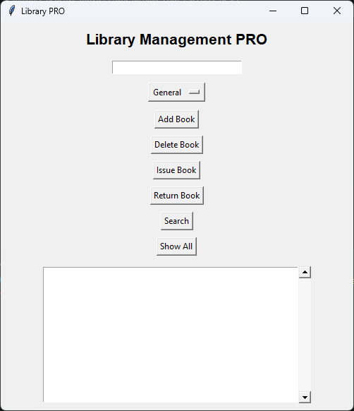
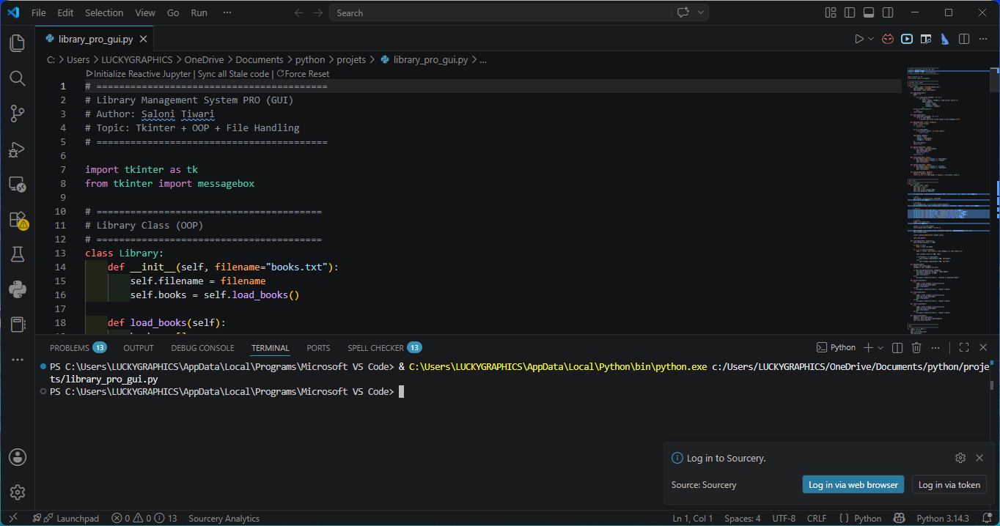

# 📚 Library Management System (Console + GUI + PRO)

A complete Library Management System developed using Python and Tkinter.

This project demonstrates the evolution of a simple console-based application into advanced GUI-based applications with structured features and file handling.

---

# 📌 Project Description

This repository contains three versions of a Library Management System developed while learning Python programming and GUI development.

The project progresses from a beginner-level console application to advanced GUI-based systems.

---

# 🚀 Project Levels

## 1️⃣ Level 1 — Console-Based System

A simple menu-driven Library Management System using core Python concepts.

### Features

- Add Book
- View Books
- Search Book
- Delete Book
- Persistent storage using file handling

📄 File:
```text
library_management.py
```

---

## 2️⃣ Level 2 — GUI-Based System

A graphical version built using Tkinter.

### Features

- User-friendly interface
- Button-based operations
- Input fields for books
- List display area
- Add/View/Search/Delete operations

📄 File:
```text
library_management_gui.py
```

---

## 3️⃣ Level 3 — Library PRO GUI

An advanced GUI version with additional management features.

### Features

- Book status tracking (Available / Issued)
- Category system
- Search functionality
- Color-coded status display
- Issue / Return system
- Better GUI layout
- File-based persistent storage

📄 File:
```text
library_pro_gui.py
```

---

# ✨ Common Features

- Add Books
- View Books
- Search Books
- Delete Books
- File Handling
- Persistent Data Storage
- Structured Python Programming

---

# 🛠 Improvements Added

- Prevents empty book names
- Prevents duplicate books
- Case-insensitive search
- Cleaner GUI design
- Better button organization
- Improved file handling

---

# 🧰 Technologies Used

- Python
- Tkinter (GUI Development)
- File Handling
- Lists & Dictionaries
- Loops & Conditions
- Object-Oriented Programming (Basic)

---

# 📁 Project Structure

```text
Library-Management-System/
│
├── library_management.py
├── library_management_gui.py
├── library_pro_gui.py
├── library_management_system.png
│
├── books.txt
│
├── screenshots/
│   └── library_gui.png
│
└── README.md
```

---

# ▶️ How to Run

## Run Console Version

```bash
python library_management.py
```

---

## Run GUI Version

```bash
python library_management_gui.py
```

---

## Run PRO Version

```bash
python library_pro_gui.py
```

---

# 📸 Screenshots


### GUI Version


### Terminal Version


---

# 💻 Example Console Output

```text
===== Library Management System =====

1. Add Book
2. View Books
3. Search Book
4. Delete Book
5. Exit

Enter your choice:
```

---

# 🧠 Learning Purpose

This project helps in understanding:

- Python Programming Basics
- File Handling
- Menu-Driven Programs
- GUI Development using Tkinter
- Object-Oriented Programming
- Real-world Project Design

---

# ⚙️ Project Logic / Approach

## Console Version

- Uses list storage
- Reads file at start
- Writes file after updates

---

## GUI Version

- Uses Tkinter Listbox
- Button-based interaction
- Input field handling

---

## PRO Version

- Uses dictionary structure

Example:

```python
{
    "title": "Python",
    "status": "Available",
    "category": "Study"
}
```

- Color-coded status display
- Issue / Return logic
- Better data management

---

# ⏱ Complexity

| Operation      | Time Complexity |
|----------------|----------------|
| Add Book       | O(1) |
| View Books     | O(n) |
| Search Book    | O(n) |
| Delete Book    | O(n) |

---

# 🚀 Future Improvements

- Database integration (SQLite/MySQL)
- User login system
- Due date & fine system
- Book issue tracking
- Search filters
- Dark mode GUI
- Export book data

---

# ⚠️ Common Mistakes Faced

- Forgetting to save file after update
- Duplicate book entries
- Empty input handling
- Incorrect file formatting
- GUI list synchronization issues

---

# 👨‍💻 Author

Saloni Tiwari  
IIT Madras BS Degree Program Student

GitHub: 25f2005869-glitch

---

# ⭐ Project Level

| Level | Difficulty |
|-------|-------------|
| Console Version | Beginner |
| GUI Version | Beginner+ |
| PRO GUI Version | Intermediate |

---

# 🙌 Acknowledgement

This project is created as part of learning Python, GUI development, file handling, and structured application design.
