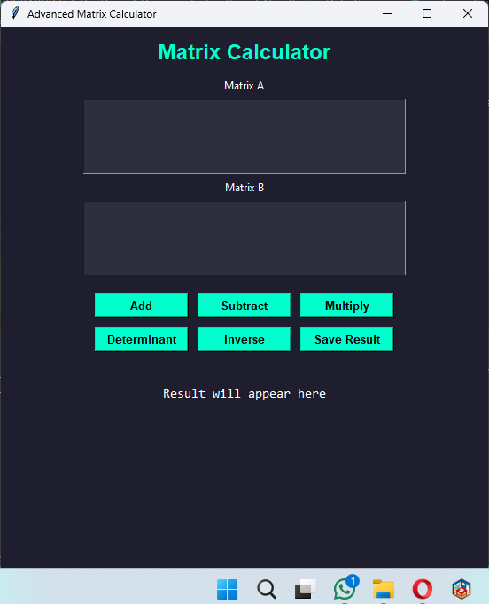
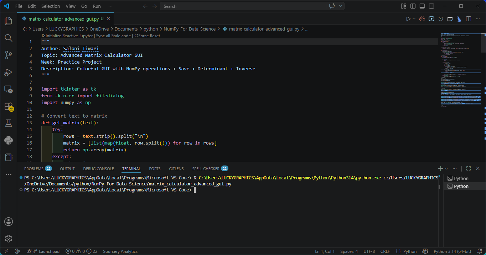

# 🧮 Matrix Calculator Collection (NumPy + GUI)

Built using Python, Tkinter, and NumPy.

This repository contains multiple versions of a Matrix Calculator developed while learning NumPy and GUI development in Python.  
The project progresses from a simple command-line calculator to advanced GUI-based matrix applications.

---

# 📌 Project Overview

This collection demonstrates:

- Matrix operations using NumPy
- CLI vs GUI application development
- Tkinter GUI design
- Matrix formatting and calculations
- File handling in Python
- Structured project development

---

# 🚀 Projects Included

## 1️⃣ NumPy Matrix Calculator (CLI)

Features:

- Matrix Addition
- Matrix Subtraction
- Matrix Multiplication

📄 File:
```text
matrix_calculator_numpy.py
```

---

## 2️⃣ Matrix Calculator GUI (Tkinter)

Features:

- GUI-based interface
- Matrix Addition
- Matrix Subtraction
- Matrix Multiplication
- Easy matrix input

📄 File:
```text
matrix_calculator_gui.py
```

---

## 3️⃣ Advanced Matrix Calculator GUI

Features:

- Colorful Dark UI
- Formatted matrix result display
- Matrix Addition
- Matrix Subtraction
- Matrix Multiplication
- Determinant
- Matrix Inverse
- Save result to file

📄 File:
```text
matrix_calculator_advanced_gui.py
```

---

# 📸 Screenshots

## Matrix Calculator GUI



---

## Terminal Run



---

# ⚙️ Requirements

Make sure the following are installed:

- Python 3.x
- NumPy
- Tkinter (comes pre-installed with Python)

Install NumPy:

```bash
pip install numpy
```

---

# 📁 Project Structure

```text
projects/
│
├── matrix_calculator_numpy.py
├── matrix_calculator_gui.py
├── matrix_calculator_advanced_gui.py
│
├── matrix_calculator_gui.png
├── matrix_project_run_terminal.png
│
└── README.md
```

---

# ▶️ How to Run

Run CLI version:

```bash
python matrix_calculator_numpy.py
```

Run GUI version:

```bash
python matrix_calculator_gui.py
```

Run Advanced GUI version:

```bash
python matrix_calculator_advanced_gui.py
```

---

# 🎯 Learning Objectives

This project helps in understanding:

- NumPy arrays and matrix operations
- CLI vs GUI application development
- Tkinter for GUI design
- File handling in Python
- Writing clean and structured code
- Matrix-based numerical computing

---

# 👨‍💻 Author

Saloni Tiwari  
IIT Madras BS Degree Program Student

---

# ⭐ Acknowledgement

This project is created as part of learning Python, NumPy, and GUI development for Data Science.
