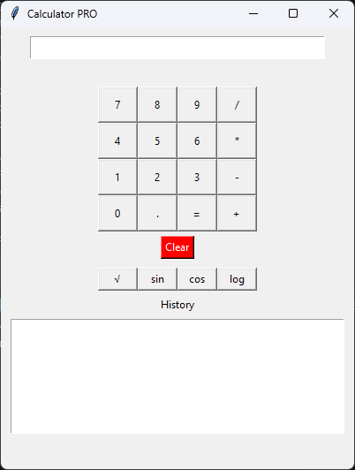
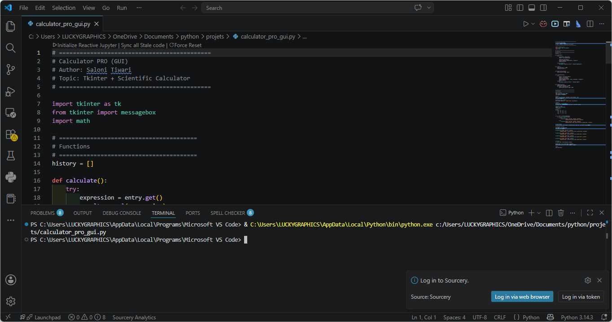

# 🧮 Python Calculator Project (CLI + GUI + PRO)

A Python-based calculator project implemented in three different versions:

- 💻 CLI Version (Command Line Interface)
- 🖥️ GUI Version (Tkinter Basic)
- 🚀 GUI PRO Version (Advanced Scientific Calculator)

This project demonstrates the evolution from a simple calculator to a feature-rich GUI application.

---

# 📌 Project Overview

This project was created to practice:

- Python fundamentals
- Functions & modular programming
- Tkinter GUI development
- Event-driven programming
- Scientific calculations using Python
- GUI design improvement

---

# ✨ Features

## 💻 CLI Version

- Addition
- Subtraction
- Multiplication
- Division
- Menu-driven interface
- Exception handling

---

## 🖥️ GUI Version

- Input fields for numbers
- Operation buttons
- Result display
- Simple user interface

---

## 🚀 GUI PRO Version

Advanced calculator features:

- Scientific functions
- Calculation history
- Keyboard input support
- Enhanced UI
- Full calculator keypad
- Clear button
- Better user interaction

---

# 🛠️ Technologies Used

- Python 3
- Tkinter (GUI Development)
- Math Module
- Functions & Logic
- Git & GitHub

---

# 📂 Project Structure

```text
python-calculator-project/
│
├── cli_calculator.py
├── calculator_gui.py
├── calculator_pro_gui.py
├── calculator_pro_gui.png
├── calculator_pro_terminal.png
└── README.md
```

---

# 🖼️ Project Screenshots

## 🖥️ GUI PRO Calculator

<p align="center">
  
</p>

---

## 💻 CLI Calculator

<p align="center">
  
</p>

---

# ▶️ How to Run

## ✅ Run CLI Version

```bash
python cli_calculator.py
```

---

## ✅ Run GUI Version

```bash
python calculator_gui.py
```

---

## ✅ Run GUI PRO Version

```bash
python calculator_pro_gui.py
```

---

# 📋 CLI Example

```text
Select operation:
1. Add
2. Subtract
3. Multiply
4. Divide

Enter choice: 1
Enter first number: 5
Enter second number: 3

Result: 5 + 3 = 8
```

---

# 📚 Learning Outcomes

By completing this project, I practiced:

- Python programming fundamentals
- Functions and modular code
- Tkinter GUI development
- Event-driven programming
- Scientific calculations using `math` module
- Error handling
- User interface design

---

# 🚀 Future Improvements

- Dark Mode UI
- History export
- Voice input
- Keyboard shortcuts
- Advanced mathematical graphs
- Memory functions

---

# 👩‍💻 Author

Saloni Tiwari  
Python & Data Science Student

---

# 📊 Project Level

🟢 CLI → Beginner  
🟡 GUI → Beginner+  
🔵 GUI PRO → Intermediate

---

⭐ This project is great for beginners transitioning from CLI applications to GUI-based real-world Python applications.
