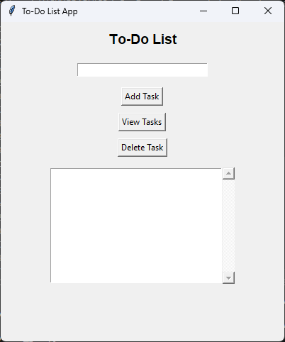
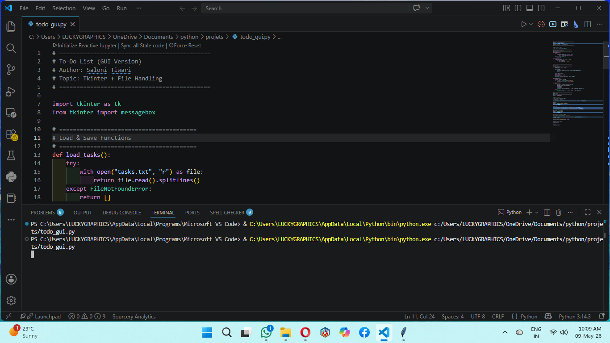
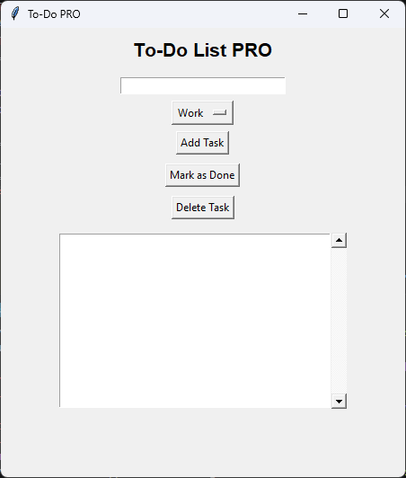
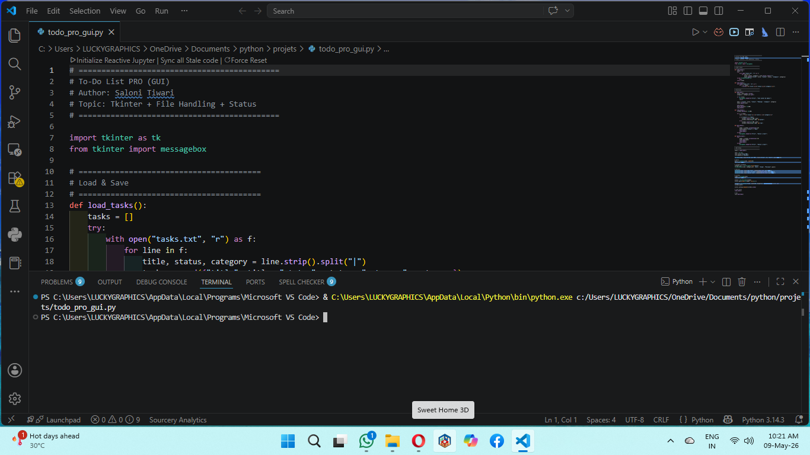

<!-- ===================== HEADER ===================== -->

<p align="center">
  
</p>

<p align="center">
  
</p>

---

# 📝 To-Do List Application (CLI + GUI + PRO)

A beginner-friendly Python To-Do List project with three different versions:

- 💻 **CLI Version**
- 🖥 **Basic GUI Version**
- 🚀 **PRO GUI Version**

All versions use the same shared **`tasks.txt`** file for persistence and compatibility.

---

# 📌 Project Description

This project helps users manage daily tasks efficiently.

Users can:

- ➕ Add tasks
- 📋 View tasks
- ❌ Delete tasks
- ✅ Mark tasks as Done *(PRO)*
- 🗂 Categorize tasks *(PRO)*

---

# ✨ Features

- ✅ Add / View / Delete tasks
- ✅ Persistent storage using `tasks.txt`
- ✅ GUI interaction using Tkinter
- ✅ Status tracking *(Pending / Done)*
- ✅ Categories *(Work / Study / Personal)*
- ✅ Color-coded tasks *(PRO)*
- ✅ Shared storage system
- ✅ Auto-migration from older task formats
- ✅ Beginner-friendly code structure

---

# 🛠 Technologies Used

<p align="center">


</p>

---

# 📂 Project Structure

```text
python-todo-cli/
├── todo.py
├── todo_gui.py
├── todo_pro_gui.py
├── task_storage.py
├── tasks.txt
└── README.md
```

---

# ▶️ How to Run

## 💻 CLI Version

```bash
python todo.py
```

## 🖥 Basic GUI Version

```bash
python todo_gui.py
```

## 🚀 PRO GUI Version

```bash
python todo_pro_gui.py
```

---

# 💾 Unified Storage Format (`tasks.txt`)

All versions use a shared storage format:

```text
title|status|category
```

### Example

```text
Study Python|Pending|Study
Buy Milk|Done|Personal
Call Doctor|Pending|Work
```

---

# 📸 Screenshots

## 🖥 Basic GUI Window



---

## 🖥 Basic GUI + Terminal



---

## 🚀 PRO GUI Window



---

## 🖥 PRO GUI + Terminal



---

# 🧠 Concepts Used

- Python Functions
- Lists & Dictionaries
- File Handling
- Tkinter GUI
- Conditional Logic
- Status Management

---

# ⚡ Complexity (Big-O)

| Operation | Time Complexity |
|-----------|------------------|
| Add Task | O(1) |
| View Tasks | O(n) |
| Delete Task | O(n) |

---

# 🚀 Future Improvements

- 🌙 Dark Mode
- 🔍 Search Tasks
- 📅 Due Dates & Reminders
- 🗄 SQLite Database Integration
- ☁ Cloud Backup

---

# 👩‍💻 Author

**Saloni Tiwari**  
🎓 IIT Madras BS Data Science Student  
💻 Python Learner | Data Analysis Enthusiast

---

<p align="center">
  🚀 Building Projects Daily • Learning Step by Step
</p>
