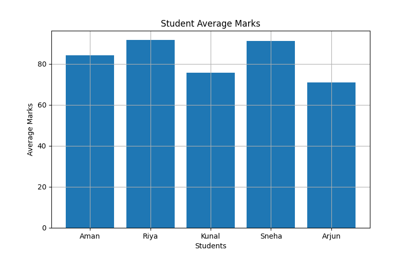
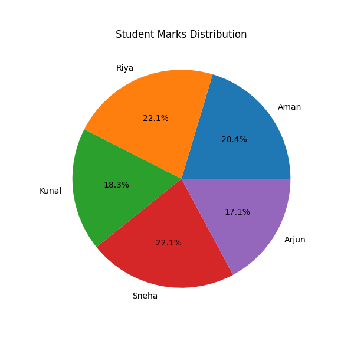
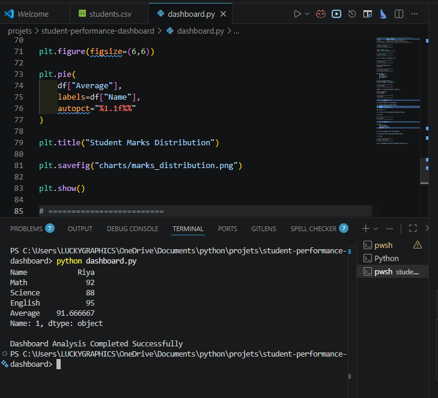

# 📊 Student Performance Dashboard

A beginner-friendly Data Analytics Dashboard built using Python, Pandas, and Matplotlib to analyze student marks and visualize performance data using charts and graphs.

This project demonstrates:
- CSV handling
- Data analysis
- Data visualization
- Dashboard-style reporting using Python

---

# 🚀 Features

✅ Student Marks Analysis  
✅ Average Marks Calculation  
✅ Topper Identification  
✅ CSV File Handling  
✅ Bar Chart Visualization  
✅ Pie Chart Visualization  
✅ Terminal-Based Analytics Output  
✅ Image Export using Matplotlib  

---

# 🛠️ Technologies Used

| Technology | Purpose |
|------------|---------|
| Python | Core Programming |
| Pandas | Data Analysis |
| Matplotlib | Data Visualization |
| CSV | Dataset Storage |

---

# 📂 Project Structure

```text
student-performance-dashboard/
│
├── dashboard.py
├── students.csv
├── student_average_marks.png
├── marks_distribution.png
├── dashboard_terminal_output.png
└── README.md
```

---

# 📊 Student Average Marks Chart

This bar chart shows the average marks scored by each student.



---

# 🥧 Student Marks Distribution

This pie chart visualizes the percentage distribution of student performance.



---

# 💻 Terminal Output

Project execution and analytics output displayed in the VS Code terminal.



---

# 📈 Analytics Performed

- Average marks calculation
- Topper detection
- Student-wise comparison
- Marks distribution visualization
- Dashboard-style analysis

---

# ▶️ How to Run

## Install Required Libraries

```bash
pip install pandas matplotlib
```

---

## Run the Project

```bash
python dashboard.py
```

---

# 📚 Learning Outcomes

Through this project, I learned:

- CSV file handling
- Data analysis using Pandas
- Data visualization using Matplotlib
- Saving charts as images
- Professional Python project structure

---

# 🔥 Future Improvements

- Streamlit Dashboard
- Interactive Graphs
- Student Ranking System
- Attendance Analytics
- Database Integration

---

# 👩‍💻 Author

**Saloni Tiwari**  
Aspiring Data Analyst | Python Enthusiast | IIT Madras Data Science Student
